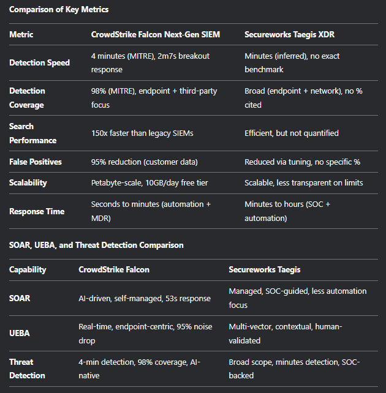

<!-- TOC start -->

- [CrowdStrike](#crowdstrike)
- [CrowdStrike vs. Secureworks Comparison](#crowdstrike-vs-secureworks-comparison)
  - [CrowdStrike Falcon Next-Gen SIEM](#crowdstrike-falcon-next-gen-siem)
    - [Key Features:](#key-features)
    - [How It Works:](#how-it-works)
    - [Benefits:](#benefits)
    - [Limitations:](#limitations)
  - [Secureworks Taegis XDR](#secureworks-taegis-xdr)
    - [Key Features:](#key-features-1)
    - [How It Works:](#how-it-works-1)
    - [Benefits:](#benefits-1)
    - [Limitations:](#limitations-1)
    - [Comparison of Key Metrics](#comparison-of-key-metrics)
  - [UEBA](#ueba)
    - [Domain Generation Algorithms (DGA) Detector](#domain-generation-algorithms-dga-detector)
    - [Rare Program to Rare IP Detector](#rare-program-to-rare-ip-detector)
    - [Stolen Credentials Detector](#stolen-credentials-detector)
    - [Tactic Graphs™ Detector](#tactic-graphs-detector)
    - [Punycode Detector](#punycode-detector)
    - [IP Watchlist](#ip-watchlist)
    - [Domain Watchlist](#domain-watchlist)
  - [Summary](#summary)
  - [HMQ Specific to Role](#hmq-specific-to-role)
    - [Technical Expertise](#technical-expertise)
    - [Problem Solving \& Collaboration](#problem-solving--collaboration)
    - [Leadership \& Mentoring](#leadership--mentoring)
    - [Security Focus](#security-focus)
    - [System Monitoring \& Operations](#system-monitoring--operations)
    - [Cultural Fit \& Soft Skills](#cultural-fit--soft-skills)
  - [HM](#hm)
    - [Technical Expertise and Problem Solving](#technical-expertise-and-problem-solving)
      - [Algorithm \& Data Structures:](#algorithm--data-structures)
      - [System Design:](#system-design)
      - [Security:](#security)
      - [Performance and Scalability:](#performance-and-scalability)
    - [Technical Depth \& Hands-on Experience](#technical-depth--hands-on-experience)
      - [Programming Languages \& Tools:](#programming-languages--tools)
      - [Cloud Infrastructure \& DevOps:](#cloud-infrastructure--devops)
    - [Collaboration \& Leadership](#collaboration--leadership)
      - [Cross-team Collaboration:](#cross-team-collaboration)
    - [Behavioral \& Problem-Solving Skills](#behavioral--problem-solving-skills)
    - [Culture Fit](#culture-fit)
    - [Knowledge of CrowdStrike Products](#knowledge-of-crowdstrike-products)
    - [Technical Proficiency:](#technical-proficiency)
    - [Problem-Solving and Design:](#problem-solving-and-design)
    - [Company Alignment:](#company-alignment)
  - [Key Questions for Hiring Manager](#key-questions-for-hiring-manager)
    - [Role Expectations and Responsibilities](#role-expectations-and-responsibilities)
    - [Team Dynamics and Collaboration](#team-dynamics-and-collaboration)
    - [Company Culture and Values](#company-culture-and-values)
    - [Technology and Tools](#technology-and-tools)
    - [Career Growth and Development](#career-growth-and-development)
    - [Innovation and Industry Leadership](#innovation-and-industry-leadership)
    - [Customer Impact and Success](#customer-impact-and-success)
    - [Challenges and Opportunities](#challenges-and-opportunities)
    - [Work-Life Balance and Remote Work](#work-life-balance-and-remote-work)
    - [Hiring Manager’s Experience and Perspective](#hiring-managers-experience-and-perspective)
    - [Next Steps and Expectations](#next-steps-and-expectations)
    - [Competitive Landscape](#competitive-landscape)
- [Queries](#queries)
  - [Integration and Ecosystem](#integration-and-ecosystem)
  - [AI and Automation](#ai-and-automation)
  - [Detection Speed and Accuracy](#detection-speed-and-accuracy)
  - [Scalability and Performance](#scalability-and-performance)
  - [Cost and Pricing Model](#cost-and-pricing-model)
  - [Compliance and Reporting](#compliance-and-reporting)
  - [Deployment and Management](#deployment-and-management)
  - [Threat Intelligence](#threat-intelligence)
  - [Managed Services and Support](#managed-services-and-support)
  - [Comparison with Competitors](#comparison-with-competitors)
  - [Future-Proofing and Innovation](#future-proofing-and-innovation)
  - [Customer Success and Case Studies](#customer-success-and-case-studies)
  - [Vendor Lock-In and Flexibility](#vendor-lock-in-and-flexibility)
  - [Training and Skill Development](#training-and-skill-development)
  - [Real-World Performance and Metrics](#real-world-performance-and-metrics)

<!-- TOC end -->

# CrowdStrike
CrowdStrike's engineering organization is structured to support its diverse range of cybersecurity products and services. Karan Gupta leads the global engineering team, focusing on the AI-native Falcon platform, which encompasses various security domains such as endpoint, identity, cloud security, next-gen SIEM, data protection, exposure management, IT automation, and threat intelligence.

The Falcon platform is designed to protect critical areas of enterprise risk, including endpoints, cloud workloads, identities, and data.
 This comprehensive approach ensures that CrowdStrike's engineering efforts are aligned with its product offerings, providing robust security solutions to its clients.

While specific details about the internal subdivisions within the engineering department are not publicly disclosed, it is reasonable to infer that the organization is segmented to align with these key product areas, ensuring dedicated focus and expertise in each domain.

<!-- TOC -->
# CrowdStrike vs. Secureworks Comparison
<!-- TOC -->
## CrowdStrike Falcon Next-Gen SIEM
Core Focus: AI-native, cloud-based SIEM integrated into the Falcon platform.

<!-- TOC -->
### Key Features:

Unified Data Integration: Aggregates data from endpoints, cloud, identity systems, and third-party sources.

AI and Automation: Uses AI-driven analytics and SOAR capabilities for high-fidelity alerts and automated incident response.

High-Speed Performance: 150x faster search performance compared to legacy SIEMs.

Cost-Effectiveness: Claims up to 80% cost reduction compared to traditional SIEMs.

Compliance Support: Built-in reporting for GDPR, HIPAA, PCI-DSS, and SOX.

Charlotte AI: Generative AI security analyst for query building and threat analysis.

<!-- TOC -->
### How It Works:

Data Collection: Ingests logs from Falcon sensors, cloud environments, and third-party systems.

Analysis and Detection: Correlates data with CrowdStrike’s threat intelligence for real-time threat detection.

Response: Unified console for investigation and response, with automation for rapid containment.

<!-- TOC -->
### Benefits:

Speed: Detects threats in minutes (e.g., 2 minutes 7 seconds breakout time).

Scalability: Handles petabyte-scale data with cloud-native architecture.

Visibility: Eliminates blind spots with long-term, cost-effective log retention.

<!-- TOC -->
### Limitations:

May lack niche features of traditional SIEMs like Splunk or QRadar (e.g., ultra-long-term log retention).

Endpoint-centric approach may require additional integration for non-endpoint threats.

<!-- TOC -->
## Secureworks Taegis XDR
Core Focus: Combines XDR with SIEM-like capabilities, emphasizing managed services and broad telemetry coverage.

<!-- TOC -->
### Key Features:

Managed Services: 24/7 SOC monitoring and response by Secureworks’ Counter Threat Unit.

Broad Telemetry: Integrates data from endpoints, networks, cloud, and identity systems.

Behavioral Analytics: Uses Red Cloak analytics for anomaly detection and threat hunting.

Threat Intelligence: Leverages global client data and human expertise for high-fidelity alerts.

<!-- TOC -->
### How It Works:

Data Collection: Pulls telemetry from diverse sources, including endpoints, networks, and cloud.

Analysis and Detection: Applies behavioral analytics and threat intelligence for threat detection.

Response: Guided remediation by SOC analysts, with automation for repetitive tasks.

<!-- TOC -->
### Benefits:

Comprehensive Coverage: Detects threats across multiple vectors (endpoints, networks, cloud).

Managed Services: Reduces burden on in-house teams with 24/7 SOC support.

Flexibility: Integrates with existing security tools and investments.

<!-- TOC -->
### Limitations:

Less emphasis on AI-driven automation compared to CrowdStrike.

Slower real-time detection and response compared to CrowdStrike’s AI-native platform.

<!-- TOC -->
### Comparison of Key Metrics

<!-- TOC -->
## UEBA
User and Entity Behavior Analytics (UEBA) principles are increasingly being incorporated into various detection mechanisms to enhance their effectiveness. Here's how UEBA principles can be integrated into the specific detectors you mentioned:

<!-- TOC -->
### Domain Generation Algorithms (DGA) Detector
UEBA Integration: UEBA can analyze the behavior of users or entities generating domain names. For example, if a user suddenly starts generating a large number of seemingly random domain names, this could be flagged as anomalous behavior. UEBA can also correlate this with other activities, such as unusual login times or access patterns, to identify potential malicious intent.

Behavioral Baseline: Establish a baseline of normal domain generation activities for each user or entity. Any deviation from this baseline, such as a sudden spike in domain generation, can trigger an alert.

<!-- TOC -->
### Rare Program to Rare IP Detector
UEBA Integration: UEBA can monitor the behavior of programs and their interactions with IP addresses. If a rarely used program suddenly starts communicating with a rare or previously unseen IP address, UEBA can flag this as suspicious. The system can also consider the context, such as whether the user typically uses this program or if the IP address is associated with known malicious activity.

Contextual Analysis: UEBA can provide context by analyzing the user's historical behavior, such as whether they have previously used the program or communicated with similar IP addresses.

<!-- TOC -->
### Stolen Credentials Detector
UEBA Integration: UEBA can detect anomalies in login behavior that may indicate stolen credentials. For example, if a user suddenly logs in from a new location, at an unusual time, or with a different device, UEBA can flag this as suspicious. Additionally, UEBA can monitor for patterns such as rapid successive logins from different locations, which could indicate credential stuffing attacks.

Behavioral Profiling: Create profiles of normal login behavior for each user, including typical login times, locations, and devices. Any deviation from this profile can trigger further investigation.

<!-- TOC -->
### Tactic Graphs™ Detector
UEBA Integration: Tactic Graphs™ Detector can leverage UEBA to analyze the behavior of users or entities in the context of their interactions within a graph structure. For example, if a user suddenly starts interacting with a high number of previously unconnected nodes (e.g., files, systems, or other users), this could indicate a reconnaissance or lateral movement attempt.

Graph Behavior Analysis: UEBA can establish normal interaction patterns within the graph and detect anomalies, such as sudden changes in the number or type of interactions.

<!-- TOC -->
### Punycode Detector
UEBA Integration: UEBA can monitor the behavior of users or entities accessing Punycode domains. If a user suddenly starts accessing a large number of Punycode domains, especially those that resemble well-known domains (a technique often used in phishing attacks), UEBA can flag this as suspicious.

Access Pattern Analysis: Analyze the historical access patterns of users to identify unusual spikes in Punycode domain access, particularly if these domains are not typically accessed by the user.

<!-- TOC -->
### IP Watchlist
UEBA Integration: UEBA can enhance IP watchlist monitoring by analyzing the behavior of users or entities interacting with IP addresses on the watchlist. For example, if a user suddenly starts communicating with multiple IP addresses on the watchlist, UEBA can flag this as suspicious, especially if the user has no history of such interactions.

Behavioral Correlation: Correlate IP watchlist hits with other behavioral anomalies, such as unusual login times or data access patterns, to identify potential threats.

<!-- TOC -->
### Domain Watchlist
UEBA Integration: Similar to the IP watchlist, UEBA can monitor the behavior of users or entities accessing domains on the watchlist. If a user suddenly starts accessing multiple domains on the watchlist, especially if these domains are associated with malicious activity, UEBA can flag this as suspicious.

Historical Context: Provide historical context by analyzing whether the user has previously accessed similar domains or if this behavior represents a significant deviation from their normal activity.

<!-- TOC -->
## Summary
Incorporating UEBA principles into these detectors involves:
Behavioral Baselines: Establishing normal behavior patterns for users and entities.
Anomaly Detection: Identifying deviations from these baselines that may indicate malicious activity.
Contextual Analysis: Providing context by correlating anomalies with other behavioral data.
Continuous Learning: Updating behavioral profiles and detection rules based on new data and evolving threats.

By integrating UEBA principles, these detectors can move beyond simple rule-based detection to more sophisticated, behavior-based threat detection, improving their ability to identify and respond to advanced threats.

<!-- TOC -->
## HMQ Specific to Role
<!-- TOC -->
### Technical Expertise
Can you describe your experience working with cloud-native microservices?

Follow-up: How have you used cloud platforms like AWS to deploy these services at scale?
You’ll be designing systems to handle trillions of events per day. What strategies have you used to optimize high-volume, high-performance data processing systems in the past?

Follow-up: How do you ensure the systems you build can scale to meet increasing demand?
What are some of the biggest challenges you’ve faced when designing or implementing large-scale distributed systems?

Follow-up: How did you overcome these challenges?
Have you worked with technologies like Go, Kafka, Redis, and OpenSearch? Can you give examples of projects where you’ve integrated these technologies into your solutions?

What’s your experience with user and entity behavior analytics (UEBA)? How would you approach building or enhancing a UEBA system?

<!-- TOC -->
### Problem Solving & Collaboration
This role involves leading projects across multiple teams. How do you typically approach cross-functional collaboration and ensure alignment across different stakeholders?

Describe a time when you had to make a tough architectural decision. What were the trade-offs, and how did you justify your decision?

Can you walk us through a project where you took end-to-end ownership? What steps did you take to ensure the project was successful, and how did you handle setbacks?

<!-- TOC -->
### Leadership & Mentoring
This role requires mentoring junior engineers. How do you foster technical excellence and help junior team members grow?

Can you share an example where you led or contributed significantly to the technical direction of a product or team? What were the key outcomes?

<!-- TOC -->
### Security Focus
CrowdStrike is focused on building advanced security solutions. What’s your experience with cybersecurity principles, particularly threat detection?

How do you ensure security best practices are incorporated into the design and development of cloud-native systems?

Given your understanding of cybersecurity, how would you approach designing a system to defend against sophisticated cyber threats?

<!-- TOC -->
### System Monitoring & Operations
This role requires ongoing monitoring and operational support for production systems. How have you approached system monitoring in the past? What tools have you used, and how did they help you ensure system reliability?

Have you been involved in on-call rotations before? How do you handle incidents, and what steps do you take to minimize system downtime?

<!-- TOC -->
### Cultural Fit & Soft Skills
CrowdStrike values a culture of autonomy and flexibility. Can you share an example of how you've successfully worked in a high-trust environment with minimal supervision?

How do you prioritize tasks in a fast-paced environment, especially when managing multiple high-priority projects?

Given the rapid pace of change in cybersecurity, how do you stay up-to-date with emerging trends and technologies?

## HM
When preparing for a Senior Software Engineer II interview at CrowdStrike, it's essential to anticipate questions that assess both your technical expertise and your alignment with the company's mission and values. Based on available information, here are some questions you might encounter:

### Technical Expertise and Problem Solving
#### Algorithm & Data Structures:
Can you explain how you would design a system to process and store petabytes of data efficiently?
How do you approach optimizing algorithms for large-scale systems?
#### System Design:
Describe a complex system you've designed in the past. What challenges did you face, and how did you address them?
How would you design a scalable, high-availability microservices architecture for a global security platform?
#### Security:
Given CrowdStrike’s focus on cybersecurity, how would you go about detecting and preventing security breaches in a large cloud-based application?
Can you describe how you would design an authentication system for a multi-cloud application?
#### Performance and Scalability:
What are some strategies you've used to ensure your code is scalable and performs well under load?
How would you approach troubleshooting a performance bottleneck in a distributed system?
### Technical Depth & Hands-on Experience
#### Programming Languages & Tools:
What programming languages do you feel most comfortable with, and how have you applied them in previous roles?
Have you worked with real-time data processing frameworks? How did you integrate them into your solutions?
#### Cloud Infrastructure & DevOps:
What cloud platforms (AWS, Azure, GCP) have you worked with? How would you use them to support a scalable security solution?
How do you handle CI/CD in a large, distributed environment?
###  Collaboration & Leadership
#### Cross-team Collaboration:
How do you handle working with product managers and other engineering teams to define requirements and deliver features?
Can you describe a time when you had to collaborate with a non-technical team or customer? How did you communicate technical concepts effectively?
Mentorship:
How do you approach mentoring junior engineers? Can you give an example of how you’ve helped someone grow technically?
How do you ensure code quality and consistency across a large team of engineers?
### Behavioral & Problem-Solving Skills
Handling Failure:
Can you tell me about a time when you faced a major setback in a project? How did you handle it, and what did you learn from it?
Describe a time when a project didn’t go as planned. How did you get it back on track?
Conflict Resolution:
Have you had a disagreement with a colleague over a technical approach? How did you resolve it?
Decision Making:
Tell me about a time when you had to make a difficult technical decision. What factors did you consider, and what was the outcome?
### Culture Fit
Why CrowdStrike?
What interests you about CrowdStrike and our mission to protect organizations from cybersecurity threats?
How do you align your career goals with CrowdStrike’s values and growth trajectory?
Ownership & Accountability:
Can you describe a time when you took full ownership of a project or feature? What was the impact, and how did you ensure its success?
### Knowledge of CrowdStrike Products
Company Knowledge:
How familiar are you with CrowdStrike’s Falcon platform and its components?
What are some of the key challenges CrowdStrike might face in delivering security at scale, and how would you address them?

### Technical Proficiency:

Can you describe your experience with cybersecurity and incident response? 
What technology stacks have you worked with, and can you give an example of how you’ve used one to solve a complex problem? 
How would you approach scaling a web application to handle increased traffic and demand? 

### Problem-Solving and Design:

Can you describe a project you managed from start to finish? What was your role, and how did you ensure the project was successful? 
Can you explain your design process for scaling systems? 
Leadership and Collaboration:

Can you describe a time when you had to lead a team through a difficult project? What strategies did you use to ensure success? 
Can you describe a time when you had to work collaboratively on a project? What was your role, and how did you contribute to the team's success? 

### Company Alignment:

Why do you want to work at CrowdStrike? 
Based on what you know of our company, how do you plan to reach goals with your team? 
Additionally, it's beneficial to prepare thoughtful questions to ask the hiring manager, such as:

Can you describe the technical job ladder at CrowdStrike and how it relates to the management ladder? 
What are some projects you're excited about that this role would be involved in?

<!-- TOC -->
## Key Questions for Hiring Manager
<!-- TOC -->
### Role Expectations and Responsibilities
Objective: Understand the day-to-day responsibilities, key performance indicators (KPIs), and how success is measured in the role.

Sample Questions:

Can you describe the day-to-day responsibilities of this role?

What are the key metrics or KPIs used to measure success in this position?

How does this role contribute to CrowdStrike’s overall mission of stopping breaches?

Are there any specific challenges or pain points this role is expected to address?

<!-- TOC -->
### Team Dynamics and Collaboration
Objective: Learn about the team structure, collaboration style, and how cross-functional teams work together.

Sample Questions:

Can you tell me about the team I’d be working with? What are their roles and expertise?

How does this team collaborate with other departments, such as engineering, threat intelligence, or customer success?

What is the communication style within the team (e.g., agile, structured, informal)?

Are there opportunities to work on cross-functional projects?

<!-- TOC -->
### Company Culture and Values
Objective: Gain insights into CrowdStrike’s culture, values, and how they align with your own.

Sample Questions:

How would you describe CrowdStrike’s company culture?

What values are most important to CrowdStrike, and how are they reflected in day-to-day operations?

How does CrowdStrike foster diversity, equity, and inclusion within the workplace?

Can you share an example of how the company has lived up to its core values in a recent project or initiative?

<!-- TOC -->
### Technology and Tools
Objective: Understand the tools, technologies, and methodologies used in the role.

Sample Questions:

What tools and technologies does the team primarily use (e.g., Falcon platform, SIEM, SOAR, UEBA)?

How does CrowdStrike stay ahead of emerging threats and incorporate new technologies into its solutions?

Are there opportunities to work with AI-driven tools like Charlotte AI or Falcon Fusion SOAR?

How does the team handle continuous learning and upskilling on new technologies?

<!-- TOC -->
### Career Growth and Development
Objective: Explore opportunities for professional growth, mentorship, and skill development.

Sample Questions:

What opportunities for career growth and advancement are available at CrowdStrike?

Does CrowdStrike offer mentorship programs or opportunities to work with senior leaders?

How does the company support ongoing learning and development (e.g., training, certifications, conferences)?

Can you share examples of team members who have grown within the company?

<!-- TOC -->
### Innovation and Industry Leadership
Objective: Understand CrowdStrike’s approach to innovation and its position in the cybersecurity industry.

Sample Questions:

How does CrowdStrike maintain its leadership in the cybersecurity space, especially with competitors like Secureworks and Palo Alto Networks?

What are some of the most exciting projects or innovations the team is currently working on?

How does CrowdStrike balance innovation with the need for stability and reliability in its products?

What role does threat intelligence play in driving innovation at CrowdStrike?

<!-- TOC -->
### Customer Impact and Success
Objective: Learn how the role contributes to customer success and the overall impact of CrowdStrike’s solutions.

Sample Questions:

How does this role directly impact CrowdStrike’s customers and their security outcomes?

Can you share an example of how CrowdStrike’s solutions have helped a customer overcome a significant security challenge?

How does the team gather and incorporate customer feedback into product development?

What is CrowdStrike’s approach to ensuring customer satisfaction and retention?

<!-- TOC -->
### Challenges and Opportunities
Objective: Identify the challenges the team or company is facing and how the role can address them.

Sample Questions:

What are the biggest challenges the team is currently facing?

How does this role help address those challenges?

What opportunities do you see for CrowdStrike to grow or improve in the next 1-2 years?

How does the company stay competitive in a rapidly evolving cybersecurity landscape?

<!-- TOC -->
### Work-Life Balance and Remote Work
Objective: Understand the company’s approach to work-life balance and remote work policies.

Sample Questions:

How does CrowdStrike support work-life balance for its employees?

Does CrowdStrike offer flexible or remote work options for this role?

How does the company ensure collaboration and team cohesion in a remote or hybrid work environment?

Are there any company-wide initiatives to promote employee well-being?

<!-- TOC -->
### Hiring Manager’s Experience and Perspective
Objective: Gain insights into the hiring manager’s experience and perspective on working at CrowdStrike.

Sample Questions:

What has been your experience working at CrowdStrike, and what do you enjoy most about it?

What excites you most about the future of CrowdStrike?

How would you describe the leadership style within your team or department?

What qualities do you think are most important for someone to succeed in this role?

<!-- TOC -->
### Next Steps and Expectations
Objective: Clarify the hiring process and next steps.

Sample Questions:

What are the next steps in the hiring process, and what is the expected timeline?

Are there any specific skills or experiences you’re looking for in the ideal candidate?

Is there anything about my background or experience that you’d like me to elaborate on?

Do you have any advice for someone starting in this role at CrowdStrike?

<!-- TOC -->
### Competitive Landscape
Objective: Understand how CrowdStrike differentiates itself from competitors like Secureworks, Palo Alto Networks, and others.

Sample Questions:

How does CrowdStrike differentiate itself from competitors like Secureworks in terms of technology and customer value?

What do you think sets CrowdStrike apart as an employer compared to other cybersecurity companies?

How does CrowdStrike’s approach to threat detection and response compare to other players in the market?
# Queries
<!-- TOC -->
## Integration and Ecosystem
How does CrowdStrike’s Falcon Next-Gen SIEM integrate with our existing security tools (e.g., Splunk, QRadar, or other third-party solutions)?

Does CrowdStrike’s ecosystem support seamless integration with cloud environments (e.g., AWS, Azure, GCP) and identity systems (e.g., Okta, Microsoft Entra ID)?

Are there any limitations in integrating non-endpoint data sources (e.g., network logs, firewalls) into Falcon Next-Gen SIEM?

<!-- TOC -->
## AI and Automation
How does CrowdStrike’s AI-driven analytics (e.g., Charlotte AI) reduce false positives and improve threat detection accuracy?

Can you provide examples of how Falcon Fusion SOAR automates repetitive tasks and accelerates incident response?

How customizable are the automation workflows, and can they be tailored to our specific security needs?

<!-- TOC -->
## Detection Speed and Accuracy
CrowdStrike claims a 4-minute detection time and a 98% detection rate in MITRE tests. How does this translate to real-world performance in environments similar to ours?

How does Falcon Next-Gen SIEM handle zero-day threats and advanced persistent threats (APTs)?

What mechanisms are in place to ensure high-fidelity alerts and minimize alert fatigue?

<!-- TOC -->
## Scalability and Performance
Falcon Next-Gen SIEM claims to handle petabyte-scale data with 150x faster search performance. How does this scalability hold up in large, distributed environments like ours?

Are there any limitations in log retention periods, especially for compliance requirements that demand long-term storage (e.g., years of data)?

How does CrowdStrike ensure consistent performance as data volumes grow?

<!-- TOC -->
## Cost and Pricing Model
CrowdStrike claims up to 80% cost savings compared to legacy SIEMs. Can you break down the pricing model (e.g., ingestion-based vs. flat-rate)?

Are there any hidden costs, such as additional fees for data ingestion, storage, or third-party integrations?

How does the total cost of ownership (TCO) compare to traditional SIEMs or competitors like Secureworks?

<!-- TOC -->
## Compliance and Reporting
Does Falcon Next-Gen SIEM provide built-in reporting for compliance standards like GDPR, HIPAA, PCI-DSS, and SOX?

How customizable are the compliance reports, and can they be tailored to meet our specific regulatory requirements?

Does CrowdStrike offer any tools or features to simplify audit processes?

<!-- TOC -->
## Deployment and Management
How long does it typically take to deploy Falcon Next-Gen SIEM in an environment of our size and complexity?

What level of expertise is required to manage the platform, and does CrowdStrike offer training or support for onboarding?

Are there any challenges or common pitfalls during deployment that we should be aware of?

<!-- TOC -->
## Threat Intelligence
How does CrowdStrike’s Threat Graph enhance Falcon Next-Gen SIEM’s threat detection capabilities?

Does CrowdStrike provide real-time threat intelligence updates, and how often is the intelligence refreshed?

Can we integrate our own threat intelligence feeds into Falcon Next-Gen SIEM?

<!-- TOC -->
## Managed Services and Support
Does CrowdStrike offer managed detection and response (MDR) services for Falcon Next-Gen SIEM, similar to Falcon Complete?

What level of support is provided for incident response, and how quickly can we expect assistance during a security incident?

Are there options for 24/7 SOC support, or is the platform primarily self-managed?

<!-- TOC -->
## Comparison with Competitors
How does Falcon Next-Gen SIEM compare to competitors like Secureworks Taegis XDR in terms of speed, scalability, and ease of use?

What are the key differentiators that make CrowdStrike a better choice for organizations like ours?

Are there any areas where competitors like Secureworks outperform CrowdStrike?

<!-- TOC -->
## Future-Proofing and Innovation
How does CrowdStrike plan to evolve Falcon Next-Gen SIEM to address emerging threats and technologies (e.g., quantum computing, AI-driven attacks)?

Are there any upcoming features or updates that we should be aware of?

How does CrowdStrike ensure that its platform remains ahead of the curve in the rapidly changing cybersecurity landscape?

<!-- TOC -->
## Customer Success and Case Studies
Can you share examples of organizations similar to ours that have successfully implemented Falcon Next-Gen SIEM?

What measurable outcomes (e.g., reduced response times, cost savings) have customers achieved with Falcon Next-Gen SIEM?

Are there any notable challenges or limitations that customers have reported?

<!-- TOC -->
## Vendor Lock-In and Flexibility
How does CrowdStrike avoid vendor lock-in, especially with its tightly integrated ecosystem?

If we decide to switch platforms in the future, how easy is it to migrate data and workflows from Falcon Next-Gen SIEM?

Does CrowdStrike support open standards and APIs to ensure interoperability with other tools?

<!-- TOC -->
## Training and Skill Development
What training resources does CrowdStrike provide to help our team get up to speed with Falcon Next-Gen SIEM?

Are there certifications or hands-on workshops available for our security analysts?

How does CrowdStrike support ongoing skill development for our team?

<!-- TOC -->
## Real-World Performance and Metrics
Can you provide specific metrics (e.g., detection times, false positive rates) from real-world deployments of Falcon Next-Gen SIEM?

How does the platform perform in hybrid environments with both on-premises and cloud workloads?

Are there any performance bottlenecks we should be aware of?

These questions are designed to help you gain a deeper understanding of CrowdStrike Falcon Next-Gen SIEM’s capabilities, limitations, and suitability for your organization’s needs. Tailor them based on your specific priorities and concerns.
