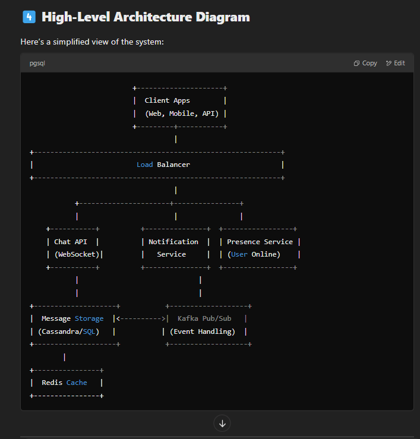

<!-- TOC start (generated with https://github.com/derlin/bitdowntoc) -->

- [Microsoft](#microsoft)
  - [Understanding the Role](#understanding-the-role)
  - [Interview Rounds and Preparation Plan](#interview-rounds-and-preparation-plan)
    - [Round 1: Recruiter Screening](#round-1-recruiter-screening)
    - [Round 2: Coding (DSA \& Problem-Solving)](#round-2-coding-dsa--problem-solving)
    - [Round 3: System Design](#round-3-system-design)
    - [Round 4: Leadership \& Behavioral](#round-4-leadership--behavioral)
  - [Tailored Preparation Plan (8 Weeks)](#tailored-preparation-plan-8-weeks)
    - [Week 1-2: Coding Mastery](#week-1-2-coding-mastery)
    - [Week 3-4: System Design](#week-3-4-system-design)
    - [Week 5-6: Behavioral \& Leadership](#week-5-6-behavioral--leadership)
    - [Week 7-8: Mock Interviews \& Refinement](#week-7-8-mock-interviews--refinement)
  - [Microsoft Principal SDE Coding Questions](#microsoft-principal-sde-coding-questions)
    - [Graphs \& Trees (High Priority)](#graphs--trees-high-priority)
    - [Dynamic Programming (Optimization Problems)](#dynamic-programming-optimization-problems)
    - [System-Oriented Coding (Cache, API Rate Limiting, Concurrency)](#system-oriented-coding-cache-api-rate-limiting-concurrency)
    - [Arrays \& Intervals (High Frequency)](#arrays--intervals-high-frequency)
    - [Advanced String Manipulation](#advanced-string-manipulation)
    - [Design a Data Structure (Custom Object Implementations)](#design-a-data-structure-custom-object-implementations)
  - [Microsoft Principal SDE – Mock System Design Questions](#microsoft-principal-sde--mock-system-design-questions)
    - [Design Microsoft Teams (Real-Time Messaging System)](#design-microsoft-teams-real-time-messaging-system)
    - [Design a Distributed File Storage System (OneDrive, Google Drive)](#design-a-distributed-file-storage-system-onedrive-google-drive)
    - [Design an API Rate Limiter (Used in Azure API Gateway)](#design-an-api-rate-limiter-used-in-azure-api-gateway)
    - [Design a Search Engine for Microsoft Docs](#design-a-search-engine-for-microsoft-docs)
    - [Design a Notification System (Outlook, Microsoft Teams)](#design-a-notification-system-outlook-microsoft-teams)
    - [Design a Cloud-Based Code Collaboration Platform (Like GitHub, Azure DevOps)](#design-a-cloud-based-code-collaboration-platform-like-github-azure-devops)
    - [Design a Distributed Logging System (Azure Monitor, Splunk)](#design-a-distributed-logging-system-azure-monitor-splunk)
    - [Design a Video Streaming Platform (Microsoft Stream, YouTube)](#design-a-video-streaming-platform-microsoft-stream-youtube)
    - [Design a Distributed Task Scheduler (Azure Batch, Kubernetes CronJobs)](#design-a-distributed-task-scheduler-azure-batch-kubernetes-cronjobs)
    - [Design a Secure Authentication System (Microsoft Entra ID, OAuth, SSO)](#design-a-secure-authentication-system-microsoft-entra-id-oauth-sso)
    - [Teams solution](#teams-solution)
    - [Problem Statement](#problem-statement)
    - [High-Level Architecture](#high-level-architecture)
    - [Detailed System Design](#detailed-system-design)
    - [Push Notification Handling](#push-notification-handling)
    - [High-Level Architecture Diagram](#high-level-architecture-diagram)
    - [Key Trade-Offs \& Design Choices](#key-trade-offs--design-choices)
    - [Scaling \& Fault Tolerance](#scaling--fault-tolerance)
    - [Security Considerations](#security-considerations)

<!-- TOC end -->

<!-- TOC -->
# Microsoft
Cracking the Microsoft Principal Software Engineer interview requires a combination of system design, coding, behavioral, and leadership skills. Since you're already a Principal Software Engineer with domain experience in cybersecurity, you likely have a strong technical foundation. Below is a structured approach tailored to your background.

<!-- TOC -->
## Understanding the Role
At Microsoft, a Principal Software Engineer (Level 65-67) is expected to:

Lead technical strategy and execution for complex projects.
Own system design for high-scale distributed systems.
Drive cross-team collaboration and technical excellence.
Mentor engineers and influence architectural decisions.
<!-- TOC -->
## Interview Rounds and Preparation Plan
Microsoft interviews typically have 5-6 rounds, covering coding, system design, leadership, and behavioral aspects.

<!-- TOC -->
### Round 1: Recruiter Screening
High-level discussion on experience, leadership, and team influence.
Expect questions like:
"Tell me about a complex system you designed."
"How do you handle cross-team dependencies?"
Preparation: Refine your resume and highlight architecture, impact, and leadership.
<!-- TOC -->
### Round 2: Coding (DSA & Problem-Solving)
2-3 rounds of data structures and algorithms.
Focus on:
Graph & Tree Algorithms (BFS, DFS, Topological Sort, Dijkstra, Trie)
Dynamic Programming (LCS, LIS, Knapsack)
System Design-Related Problems (LRU Cache, Rate Limiter)
Concurrency & Multithreading in Java
Practice: Leetcode (Hard/Medium), especially Microsoft-tagged questions.
<!-- TOC -->
### Round 3: System Design
High-level system design discussion for scalable and distributed systems.
Key topics to cover:
Microservices, API Design (REST, GraphQL, gRPC)
Database Scaling & Caching (SQL vs NoSQL, Sharding, Redis)
Event-Driven Architecture (Kafka, RabbitMQ)
High Availability, Consistency Models
Security & Compliance (OAuth, JWT, RBAC)
Example questions:
"Design a global file storage system (OneDrive, Google Drive)."
"How would you scale a messaging platform like Teams?"
Preparation: Read "Designing Data-Intensive Applications" + Grokking System Design Interviews.
<!-- TOC -->
### Round 4: Leadership & Behavioral
Microsoft follows the Leadership Principles & Growth Mindset approach.
STAR Method for structured responses.
Example questions:
"Tell me about a time you handled a technical conflict."
"How do you mentor junior engineers?"
"Describe a situation where you influenced without authority."
Preparation: Use "The Manager’s Path" for leadership insights.
<!-- TOC -->
## Tailored Preparation Plan (8 Weeks)
<!-- TOC -->
### Week 1-2: Coding Mastery
Solve 2 Leetcode Medium/Hard problems daily.
Focus on Graphs, Trees, DP, Concurrency.
Review Java multithreading, memory management.
<!-- TOC -->
### Week 3-4: System Design
Daily one system design question.
Build scalable architecture diagrams for 5 real-world systems.
Review Cloud, CAP Theorem, Eventual Consistency.
<!-- TOC -->
### Week 5-6: Behavioral & Leadership
Prepare STAR-based answers.
Conduct mock behavioral interviews.
Review past projects to highlight leadership.
<!-- TOC -->
### Week 7-8: Mock Interviews & Refinement
2 mock system design interviews per week.
Code under time constraints.
Get feedback on communication clarity.
4. Key Differentiators for Principal Role
Business Impact: Show how your solutions align with business goals.
Technical Strategy: Demonstrate a vision beyond execution.
Mentorship & Collaboration: Prove you can scale teams & decisions.
Microsoft Culture Fit: Emphasize growth mindset & leadership.

<!-- TOC -->
## Microsoft Principal SDE Coding Questions
Each category contains handpicked problems, covering core problem-solving + system-level coding.

<!-- TOC -->
### Graphs & Trees (High Priority)
* Graph traversal, shortest paths, topological sort, and trees are crucial.
* Word Ladder – Leetcode [127] (BFS)
* Alien Dictionary (Order of Characters in an Alien Language) – Leetcode [269] (Topological Sort)
* Minimum Knight Moves – Leetcode [1197] (Graph BFS)
* Find Bridges in a Graph (Tarjan’s Algorithm) – [Advanced System Problem]
* Design a Social Network Connection System (Mutual Friends, Shortest Path Between Users) – [System-Oriented Graph]
* Binary Tree Maximum Path Sum – Leetcode [124]
* Serialize and Deserialize a Binary Tree – Leetcode [297]
* Kth Smallest Element in a BST – Leetcode [230]
* Lowest Common Ancestor of a Binary Tree – Leetcode [236]
* Graph Valid Tree – Leetcode [261]
<!-- TOC -->
### Dynamic Programming (Optimization Problems)
📌 Common in high-level system logic & optimization problems.

* Edit Distance (Minimum Operations to Convert a String) – Leetcode [72]
* Longest Increasing Subsequence – Leetcode [300]
* Coin Change (Min Coins for Given Sum) – Leetcode [322]
* Paint House II (Min Cost to Paint Houses with Constraints) – Leetcode [265]
* Regular Expression Matching – Leetcode [10]
* Wildcard Matching – Leetcode [44]
* Optimal Job Scheduling with Profits – Leetcode [1235]
* Burst Balloons (Hard DP) – Leetcode [312]
* Number of Ways to Arrange a Grid with Constraints – [Custom Problem]
<!-- TOC -->
### System-Oriented Coding (Cache, API Rate Limiting, Concurrency)
📌 Microsoft values system-aware coding problems that involve APIs, caching, or multithreading.

* Implement LRU Cache – Leetcode [146]
* LFU Cache Implementation – Leetcode [460]
* Design a Rate Limiter – [API Control Problem]
* Implement a Thread-Safe Singleton in Java – [Concurrency]
* Readers-Writers Lock Implementation – [Concurrency]
* Design a ThreadPool Executor – [Advanced Multithreading]
* Concurrency in Java: Print FooBar Alternately – Leetcode [1115]
* Design an Asynchronous Task Scheduler (Using DelayQueue/PriorityQueue) – [Custom System Problem]
<!-- TOC -->
### Arrays & Intervals (High Frequency)
📌 Microsoft likes interval-based problems that involve sorting or merging logic.

* Merge Intervals – Leetcode [56]
* Insert Interval – Leetcode [57]
* Meeting Rooms II – Leetcode [253]
* Find Missing Ranges in a Sorted List – Leetcode [163]
* Subarray Sum Equals K – Leetcode [560]
* Maximum Product Subarray – Leetcode [152]
<!-- TOC -->
### Advanced String Manipulation
📌 Complex string parsing and transformations come up often.

* Minimum Window Substring – Leetcode [76]
* Group Anagrams – Leetcode [49]
* Implement a URL Shortener (Base62 Encoding + Hashing) – [System-Oriented Problem]
* String Compression (Run-Length Encoding) – Leetcode [443]
* Find Duplicate File in System – Leetcode [609]
<!-- TOC -->
### Design a Data Structure (Custom Object Implementations)
📌 Microsoft asks problems involving designing efficient DS.

* Implement a File System (mkdir, ls, addContentToFile, readContentFromFile) – Leetcode [588]
* Design a Twitter Clone (Tweet, Follow, Feed, Unfollow) – Leetcode [355]
* Design an In-Memory Key-Value Store with TTL Expiry – [System-Oriented]
* Implement a Time-Based Key-Value Store – Leetcode [981]
* Design a Snake Game – Leetcode [353]

<!-- TOC -->
##  Microsoft Principal SDE – Mock System Design Questions
Each question is followed by key areas to focus on during your design.

<!-- TOC -->
### Design Microsoft Teams (Real-Time Messaging System)
Key areas:
Scalable real-time chat system (WebSockets, SignalR, or gRPC)
Group chat, typing indicators, read receipts
Message persistence & indexing (SQL vs NoSQL)
Push notifications & event-driven architecture
Data replication & high availability
<!-- TOC -->
### Design a Distributed File Storage System (OneDrive, Google Drive)
Key areas:
File storage, chunking & deduplication
Consistency vs availability (CAP theorem)
Metadata management & indexing
File sharing & permission model (RBAC)
Scalability considerations (Sharding, CDN, Replication)
<!-- TOC -->
### Design an API Rate Limiter (Used in Azure API Gateway)
Key areas:
Token bucket vs leaky bucket algorithm
Distributed rate limiting (Redis, Sliding Window)
Multi-tier enforcement (per-user, per-IP, per-service)
Handling global vs regional API limits
Caching & monitoring for abuse detection
<!-- TOC -->
### Design a Search Engine for Microsoft Docs
Key areas:
Efficient text indexing (Inverted Index, Trie, Elasticsearch)
Query parsing & ranking (TF-IDF, PageRank, Vector Search)
Handling multi-language search
Distributed crawling & indexing
Real-time updates & search autocomplete
<!-- TOC -->
### Design a Notification System (Outlook, Microsoft Teams)
Key areas:
Event-driven architecture (Kafka, RabbitMQ, Azure Service Bus)
Push vs pull notifications
User preferences & delivery channels (Email, SMS, Push)
Retries, failures, and deduplication
Rate limiting & batching for efficiency
<!-- TOC -->
### Design a Cloud-Based Code Collaboration Platform (Like GitHub, Azure DevOps)
Key areas:
Version control storage (Git, Mercurial)
Pull requests, branching, and merging
CI/CD pipeline integration
User access control & repository permissions
Scalability for large codebases (Sharding, Load Balancing)
<!-- TOC -->
### Design a Distributed Logging System (Azure Monitor, Splunk)
Key areas:
Efficient log ingestion & storage
Indexing for fast queries
Log streaming & real-time monitoring
Aggregation, alerting, and visualization
Multi-region replication & fault tolerance
<!-- TOC -->
### Design a Video Streaming Platform (Microsoft Stream, YouTube)
Key areas:
Video ingestion & transcoding (Adaptive Bitrate Streaming)
CDN caching for low latency
Real-time video recommendations
Access control & DRM security
Live streaming & viewer synchronization
<!-- TOC -->
### Design a Distributed Task Scheduler (Azure Batch, Kubernetes CronJobs)
Key areas:
Task queuing & scheduling (Priority Queues, RabbitMQ)
Retry mechanisms & failure handling
Concurrency & rate limiting
Job dependency execution
Logging & monitoring of scheduled jobs
<!-- TOC -->
### Design a Secure Authentication System (Microsoft Entra ID, OAuth, SSO)
Key areas:
OAuth 2.0, JWT, and token-based authentication
Multi-factor authentication (MFA)
Role-based access control (RBAC)
Federated identity (SSO, SAML)
Session management & token expiration policies

<!-- TOC -->
### Teams solution
📌 System Design: Microsoft Teams (Real-Time Messaging System)
<!-- TOC -->
### Problem Statement
Design a real-time chat system like Microsoft Teams that allows:

One-on-one & group chats
Message persistence & indexing
Read receipts, typing indicators
Push notifications
Scalability for millions of users
<!-- TOC -->
### High-Level Architecture
🛠️ Key Components
Client Application (Web, Mobile, Desktop)
Sends/receives messages via WebSockets/gRPC.
API Gateway
Handles authentication, rate limiting, and routing.
Chat Service
Stores messages, manages chat sessions.
Uses Pub/Sub (Kafka, Redis Streams) for real-time updates.
Database Layer
SQL (PostgreSQL/MySQL) for metadata (user profiles, conversations).
NoSQL (Cassandra/DynamoDB) for messages (high write throughput).
Notification Service
Push notifications via Firebase (FCM) or Apple Push (APNs).
Presence Service
Tracks user online/offline status.
Caching (Redis/Memcached)
Stores frequently accessed messages for quick retrieval.
Load Balancer (NGINX, Envoy)
Distributes traffic across multiple chat servers.
<!-- TOC -->
### Detailed System Design
📡 Real-Time Messaging (WebSockets)
Clients establish a persistent WebSocket connection to the Chat Service.
Messages are sent via Pub/Sub (Kafka, Redis Streams) for real-time fan-out.
Offline messages are persisted in NoSQL (Cassandra) for durability.
📜 Message Storage Strategy
Feature	Storage Choice	Reason
Metadata (Users, Conversations)	SQL (PostgreSQL)	Relational data, joins required
Messages	NoSQL (Cassandra/DynamoDB)	High write throughput
Caching	Redis	Fast retrieval of recent chats
🔄 Read Receipts & Typing Indicators
Clients send typing notifications via WebSockets.
Message read state is stored in Redis for quick lookup.
Kafka triggers real-time updates to UI when a message is read.
🗄️ Scaling Strategy
Horizontally scale chat servers based on traffic.
Partition messages by conversation ID across multiple NoSQL nodes.
Use CDN caching for media files (images, videos).
<!-- TOC -->
### Push Notification Handling
Kafka triggers a Notification Service, which sends:
FCM/APNs notifications for mobile users.
Web push notifications for browser users.
<!-- TOC -->
### High-Level Architecture Diagram
Here’s a simplified view of the system:

<!-- TOC -->
### Key Trade-Offs & Design Choices
Choice	Trade-off
WebSockets vs HTTP Polling	WebSockets enable real-time updates but require persistent connections.
SQL vs NoSQL for messages	NoSQL (Cassandra) handles high writes better, but queries are more complex.
Kafka for async processing	Ensures reliable delivery but adds infrastructure overhead.
Redis for caching recent messages	Improves performance but requires invalidation logic.
<!-- TOC -->
### Scaling & Fault Tolerance
✅ Auto-scale WebSocket servers using Kubernetes.
✅ Shard messages across multiple NoSQL nodes.
✅ Deploy in multiple regions for low latency (Azure Cloud).
✅ Use fallback mechanisms (e.g., HTTP polling if WebSockets fail).

<!-- TOC -->
### Security Considerations
End-to-end encryption for message security.
OAuth 2.0 + JWT tokens for user authentication.
Role-based access control (RBAC) for permissions.